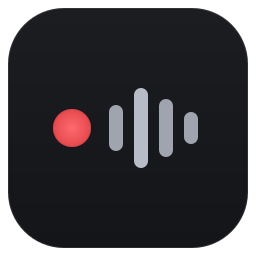
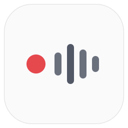

# Yip app icon

The floating recording pill turned into an app tile: a red recording dot
followed by a 4-bar level meter, read left to right, on a dark rounded square.

| 256 | 256 light | 48 | 32 | 24 | 16 | Tray idle | Tray recording |
| :---: | :---: | :---: | :---: | :---: | :---: | :---: | :---: |
|  |  |  |  |  |  |  |  |

Each size is drawn separately on its own pixel grid, not scaled from the master.

| File | Size | Content |
| --- | --- | --- |
| `yip-256.svg` | 256 and up, master | Dot with radial falloff and rim, 4 bars, tile lift, inner edge |
| `yip-light-256.svg` | 256, light surfaces | Same geometry, flat colours |
| `yip-48.svg` | 48 (also 40, 64) | Flat, 4 bars 3 px wide |
| `yip-32.svg` | 32 | Flat, 4 bars 2 px wide |
| `yip-24.svg` | 24 | Flat, 3 bars, no inner edge |
| `yip-16.svg` | 16 | Flat, 2 bars, radius 4 |
| `tray-idle-16.svg` / `tray-recording-16.svg` | 16, dark taskbar | Glyph only; grey dot when idle, red when recording |

## Master geometry (256)

- Tile 240 × 240 at an 8 px margin, radius 56, 1 px inner edge.
- Dot 38 px. Bars 14 px wide with 11 px gaps, 18 px from the dot.
- Bar heights 46 / 80 / 58 / 32 (1.21 / 2.1 / 1.53 / 0.84 × dot), centred on y = 128.
- The group spans x 53–198: 145 px, 60% of the tile, 2.5 px left of centre.
- Every edge sits on a whole pixel.

## Where this departs from the brief, and why

- **Dot size.** A 22% dot with bars 38% of it and the specified gaps makes the
  group 86% of the tile, which cannot also be 55–60%. The ratios between dot,
  bars and gaps are kept and the group is scaled to 60%, so the dot is 16%.
- **Tile lift** runs lighter at the top (`#1C1D21`) to darker at the bottom
  (`#141518`), lit from above as Fluent icons are.
- **48:** the 1.5 px margin rounds to 2 px so the tile edge lands on a pixel.
  The group sits 1 px left of centre, matching the master's offset.
- **32:** added so edges also snap at 32. A whole-pixel left shift left
  3 / 5 px margins and looked lopsided, so the group is centred.
- **24:** bars are 2 px with 1 px gaps and a 3 px gap after the dot, so the dot
  reads as separate from the meter.
- **16:** the tile is full-bleed (0.5 px margin rounds to 0). Bars are 9 and
  5 px on a y = 7.5 centre line, so odd heights keep whole-pixel edges and the
  content sits half a pixel above centre.
- **Bar opacity:** the tallest bar is 100% and the rest 85% down to 32 px. At
  24 and 16 px every bar is 100%, because lower contrast costs legibility there.
- **Tray:** without a tile there is room for a larger 6 px dot and 2 px gaps.
  The `#B7BCC8` bars are for a dark taskbar; on a light one they are faint.

## Building the .ico

`make-ico.ps1` rasterises these SVGs with headless Edge and assembles
`yip-app/Assets/yip.ico`: nine frames (16, 20, 24, 32, 40, 48, 64, 128, 256),
each from the cut drawn for that size where one exists and from the master
otherwise. Frames up to 128 are stored as 32-bit DIBs, 256 as PNG.

```powershell
powershell -ExecutionPolicy Bypass -File .design/icons/make-ico.ps1 -Repo .
```

The `.ico` is checked in, so building the app needs none of this. Re-run it
after changing any SVG here.

## Where the icon is used

- [yip-app/yip-app.rc](../../yip-app/yip-app.rc) embeds it as `IDI_YIP_APP`,
  which is what Explorer, the taskbar and Alt-Tab read off the `.exe`.
- [MainWindow.xaml.cpp](../../yip-app/MainWindow.xaml.cpp) sets it on the
  window with `WM_SETICON`, so the title bar, Alt-Tab and thumbnails use the
  frame drawn for each size.
- [installer/yip.iss](../../installer/yip.iss) uses it as `SetupIconFile`, so
  the setup `.exe` carries it too.
