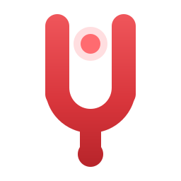
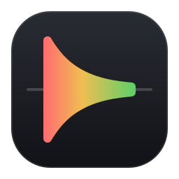
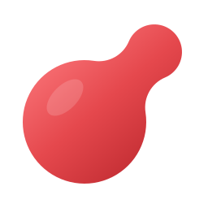

# Yip app icon concepts

Three directions. Each is either a 1:1 tile or a single distinct silhouette,
so it stays recognisable as a shape before any colour or detail reads.

| Fork | Onset | Pip |
| :---: | :---: | :---: |
|  |  |  |
|   |   |   |
| Distinct shape | 1:1 tile | Distinct shape |

## Fork

A tuning fork, which is also a **Y**. Strike one and it gives a single pure
ping, which is what a yip is. The lit dot between the tines is the record
light. The silhouette (two tines, round yoke, stem, knob) holds at 16 px.

## Onset

One short sound drawn as its envelope: an instant attack and an exponential
decay, mirrored about the baseline, on a dark tile. The fill is the app's own
meter ramp (`YipMeterGradientBrush`) run loudest-first, red to amber to green.

## Pip

The record dot budding a smaller dot, the way the floating pill grows out of
the dot when a take starts. Two circles joined by tangent arcs give it an
outline no plain record button has.

Colours are lifted from [../../yip-app/App.xaml](../../yip-app/App.xaml).
