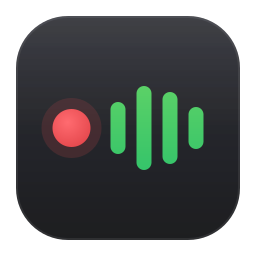

# Yip app icon

The floating recording pill turned into an app tile: a dark translucent
rounded square holding the red recording dot and the 4-bar level meter,
read left to right.

| 160 | 64 | 32 | 24 | 16 |
| :---: | :---: | :---: | :---: | :---: |
|  |  |  |  |  |

| File | Use at |
| --- | --- |
| [yip.svg](yip.svg) | 32 px and up |
| [yip-small.svg](yip-small.svg) | 16 and 24 px (drawn on a 24 px grid, no glow, heavier bars) |

## Where it comes from

- **Tile:** `YipIndicatorSurfaceBrush` (`#141518`) with the pill's quiet white
  stroke. The tile is a little denser than the pill so it still reads on a
  light taskbar.
- **Dot:** `YipIndicatorDotLiveBrush` (`#E5484D`).
- **Bars:** the green end of `YipMeterGradientBrush`, which is where a healthy
  level sits. Their heights follow `kBarWeights` (0.62, 1.00, 0.86, 0.50) in
  [IndicatorWindow.xaml.cpp](../../yip-app/IndicatorWindow.xaml.cpp), so the
  icon shows the same meter shape as the pill.

Colours are lifted from [App.xaml](../../yip-app/App.xaml).
